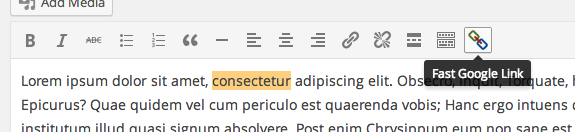

# Fast Google Link

  
*The ugly button*

Highlight text, then click the button. Behind the scenes, the first google result is fetched and returned, then the selected text will be automatically linked. If a link couldn't be found, there will be an alert to indicate so.